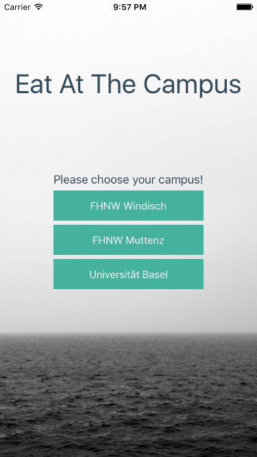
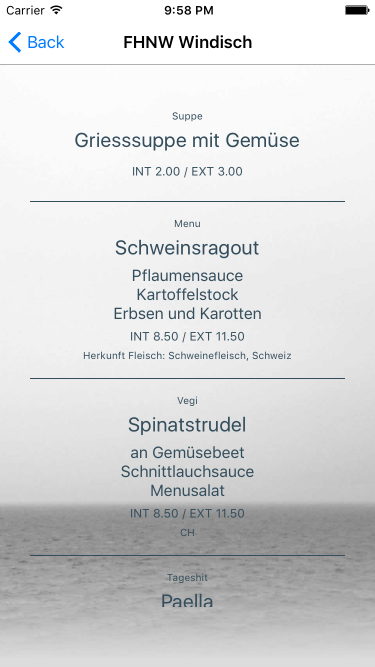

## Campus Meal (*Eat at the Campus*)
Campus Meal is an app which presents the daily menu at the campus.

### Idea
The mensa operator [SV Group][1] publishes their weekly menu plan over a mobile optimized webpage. Sadly this webpage requiers a lot of clicks to get to today's menu. So you never have the time to check the menu on your mobile phone.

Another problem is that a lot of technology affine people, which never cook themselves, do not know what some of the menus mean. Or would you know what *[Pa sa lao lao][2]* is?

So we started developing an app which shows us the daily menu and would tell us what the strange name of the menu's mean.

Take a look at the [screenshots](#Screenshots) and [download](#Download) the app!

### Screenshots
 

### Download
Download the app from the app store of your choice!

**Please be patient. We're still working on the iPhone and Android app.**

### Roadmap

* First Release
	* The basic iOS and Android app.
	* Choose your campus.
	* Take a look at today's menu.
* Second Release
	* More campus (maybe the ETH).
	* A backend for the app to make it more stable.
	* Maybe a Windows Phone app?

### Help
If you would like to share your ideas, designs or code with us, just create a [new issue](issues/new)!

We currently need:

* A new app-logo!
* Someone who thinks about a better user experience!

### Technical
We implemented the app with [Xamarin Forms][3], a cross platform framework for Android, iOS and Windows Phone. It is [free for students][4] if you ask them nicely.

At the moment we just parse the menus with regex from the webpage but later we would like to have a backend which stores the daily menu in a database. This would make the app more stable and better maintainable.

### About
In 2014 the first ideas about this project came up and some protoypes were created. Until now we started to program the app with the project name **Eat at the Campus**.

Before the realease of the first prototype we started to think about a better name for the app which resulted in **Campus Meal**.

The app is currently maintained by Florian, a computer-science student of the [FHNW][5].
A lot of thanks goes to Sara, Markus & Andreas for their support.

*Switzerland 2015*

*Disclaimer: This project or the involed people are not releated to the SV Group AG. The app just presents the content of the menu plan of the SV Group AG in simple way.*

*Information provided without guarantee.*

[1]: http://www.sv-group.ch/de/ "SV Group"
[2]: https://asiastreetfood.com/rezepte/fisch-curry-mit-lao-whiskey/ "Pa sa lao lao"
[3]: https://xamarin.com/forms "Xamarin Forms"
[4]: https://xamarin.com/student "Xamarin Students"
[5]: http://www.fhnw.ch/homepage "University of Applied Sciences and Arts Northwestern Switzerland FHNW"